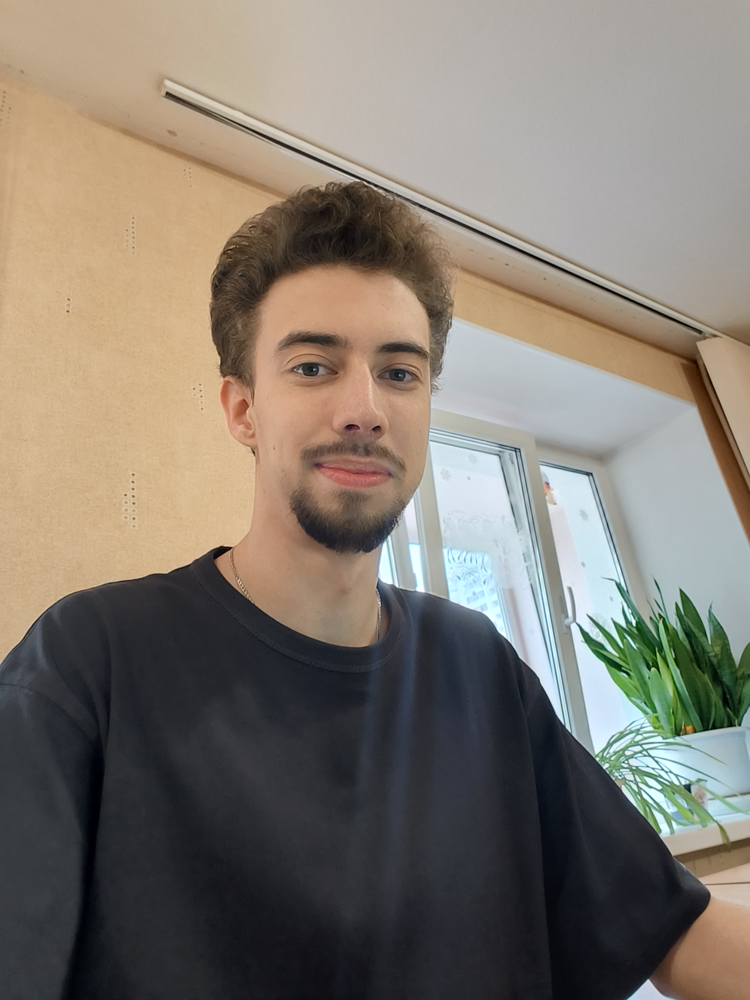

**Илья** — начинающий разработчик, который решил углубить свои знания в системах контроля версий. На данный момент он активно проходит курс по **Git**.

#### Завершённые этапы:
- Освоил базовые команды: `git init`, `git clone`, `git add`, `git commit`.
- Разобрался с созданием и слиянием веток с помощью `git branch` и `git merge`.
- Научился работать с удалённым репозиторием на **GitHub**.

#### Цели:
- Пройти курс до конца и начать использовать **Git** в реальных проектах.
- Стать уверенным пользователем **Git** для работы в команде.

